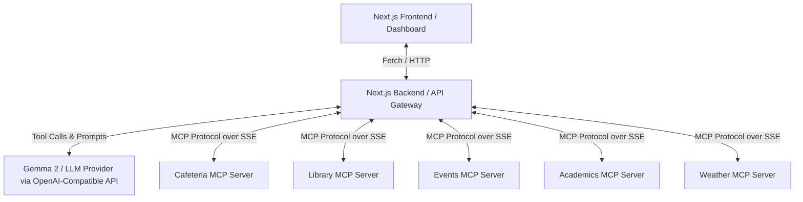

# Unified Campus Intelligence Dashboard with AI Assistant (IIT Roorkee Edition)

An elegant, real-time web portal that consolidates fragmented campus systems at **IIT Roorkee (IITR)** into a single dashboard. 

Instead of dumping scattered data (messes, calendars, libraries, weather) into a giant, centralized database using brittle web scrapers, this project utilizes **Model Context Protocol (MCP) Servers** for each distinct data source. An embedded AI Assistant dynamically queries these independent servers in real-time to answer natural-language student queries.

---

## 🏛️ Architecture Overview

The system consists of three main tiers:
1. **Dashboard UI (Next.js)**: A dark-themed, glassmorphic student dashboard containing specialized widgets and an interactive AI Assistant. It features a **Real-Time MCP Inspector** that displays the raw JSON-RPC packages sent and received over SSE.
2. **AI Gateway (Next.js App Router API)**: The orchestration layer that acts as the MCP client, fetching tools, setting up schemas, and executing the LLM tool-calling loop.
3. **MCP Server Hub (Express & Node.js)**: A single Node process hosting five independent SSE-based MCP servers (Library, Cafeteria, Events, Academics, Weather).



---

## ✨ Key Features

1. **5 Independent MCP Servers**:
   - **Library MCP**: Connects to the Mahatma Gandhi Central Library (MGCL) database properties, manages rules, and executes live searches.
   - **Cafeteria MCP**: Holds the weekly mess menu (from Monday's Poha/Jalebi to Sunday's Shahi Paneer/Custard), daily items, and local campus eateries (Desi Tadka, Ramesh Dosa, Olive & Rustic, etc.).
   - **Events MCP**: Hosts information on major annual fests (Thomso cultural, Cognizance technical, Sangram sports, Shrishti hobbies) and upcoming club workshops (SDSLabs, PAG, InfoSec, Choreography).
   - **Academics MCP**: Houses the official Autumn Semester 2026-27 calendar dates, relative grading policies, attendance requirements, and "Inane Campus Rules" (such as the lawn prohibition and the cabbage roll ritual).
   - **Weather MCP**: A dedicated, live weather server for Roorkee coordinates.
2. **Live APIs Integration**:
   - **Open Library API**: The Library MCP queries `openlibrary.org` live for search terms, enriches results with local MGCL catalog shelf mappings and availability markers, and returns them globally without requiring IITR intranet/WiFi access.
   - **Open-Meteo API**: The Weather MCP queries real-time conditions for Roorkee, providing live temperature, rain alerts, and campus advice (e.g. warnings about wet LBS Stadium tracks).
3. **Embedded AI Assistant (Aura)**: An intelligent agent that routes natural-language questions to the correct MCP servers in real-time. It can query multiple servers at once to answer complex questions (e.g., *"Is it raining in Roorkee today? Also, what's for dinner in the mess?"*).
4. **Real-Time MCP Inspector Console**: A developer console widget at the bottom of the page that lists all JSON-RPC transaction payloads in real-time, showing how the client communicates with the server endpoints.

---

## 🛠️ Tech Stack

* **Frontend & Gateway**: React.js, Next.js (App Router), Vanilla CSS (styled for glassmorphism, transitions, and responsive grid layouts).
* **MCP Backend Hub**: Node.js, Express, `@modelcontextprotocol/sdk`.
* **LLM Engine**: OpenAI-compatible client integration supporting:
  - **Gemma 2** (via Groq or OpenRouter).
  - **Gemini** (via Google AI Studio).
  - **Local Ollama** (offline development).

---

## 🚀 Setup & Launch (Under 2 Minutes)

### Prerequisites
* Node.js (v18+)
* An API Key for your LLM of choice (e.g., a free key from **Groq** or **Google AI Studio**)

### Step 1: Install Dependencies
From the root of the project, run:
```bash
npm run install:all
```
This will install all root, backend, and frontend dependencies.

### Step 2: Configure Environment Variables
Navigate to the `frontend/` directory, create a `.env` file (or edit the template provided), and add your API Key:
```env
# Groq (Gemma 2) - Recommended
LLM_BASE_URL=https://api.groq.com/openai/v1
LLM_API_KEY=gsk_YOUR_GROQ_KEY_HERE
LLM_MODEL=gemma2-9b-it

# Alternatively, Google AI Studio (Gemini)
# LLM_BASE_URL=https://generativelanguage.googleapis.com/v1beta/openai
# LLM_API_KEY=YOUR_GOOGLE_KEY_HERE
# LLM_MODEL=gemini-2.5-flash
```

### Step 3: Run the Complete Stack
From the root of the project, launch both servers concurrently:
```bash
npm run dev
```
* **Dashboard App**: Runs on [http://localhost:3000](http://localhost:3000)
* **MCP Server Hub**: Runs on [http://localhost:3001](http://localhost:3001)

---

## 🧪 Verification & Manual Testing

1. Open [http://localhost:3000](http://localhost:3000) in your browser.
2. Observe the dashboard widgets populated with live weather details and mess menus.
3. Test library search (e.g., type "Cormen" or "Algorithms" and press Search) to verify the hybrid live Open Library API fetching.
4. Try typing these questions in the AI Assistant on the right and watch the **MCP Protocol Inspector** capture the JSON-RPC traffic:
   * *"What's for lunch on Wednesday?"* (Queries Cafeteria server)
   * *"Is it raining in Roorkee today? Can we hold sports events?"* (Queries Weather server)
   * *"Can you search the library for a C++ book and tell me what the cutoff for CSE branch change was?"* (Queries Library and Academics servers in a single turn)
   * *"Tell me about the campus rules, specifically about the lawns."* (Queries Academics server)
